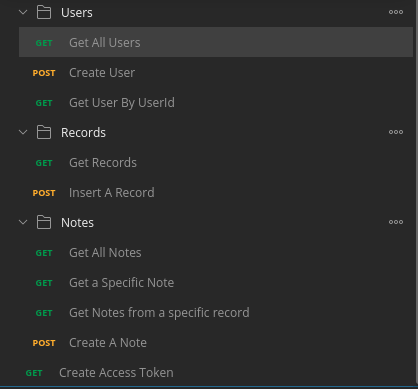
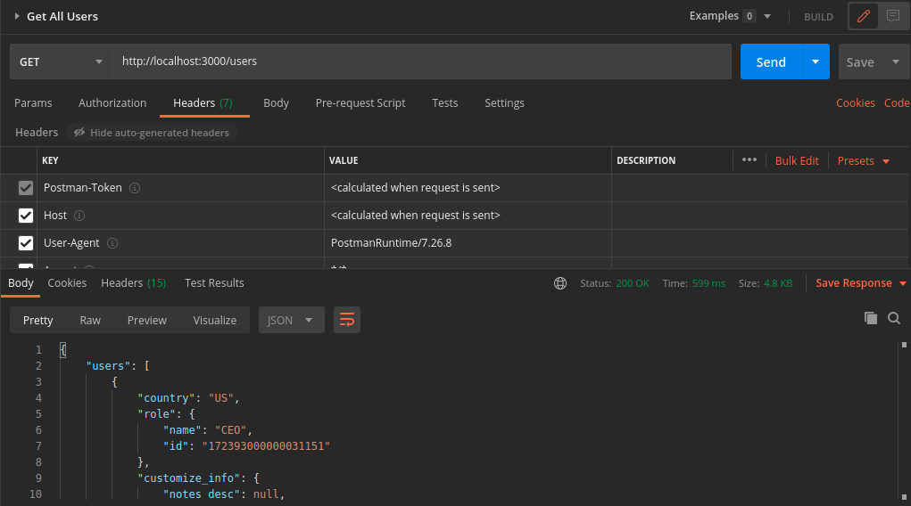
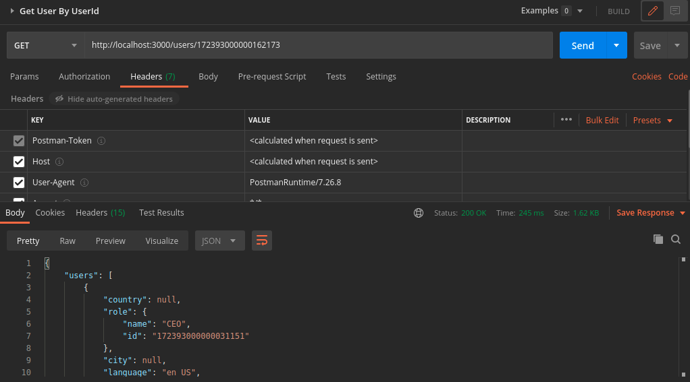
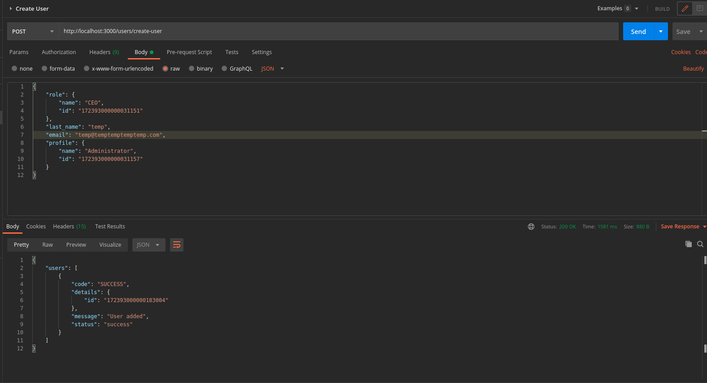
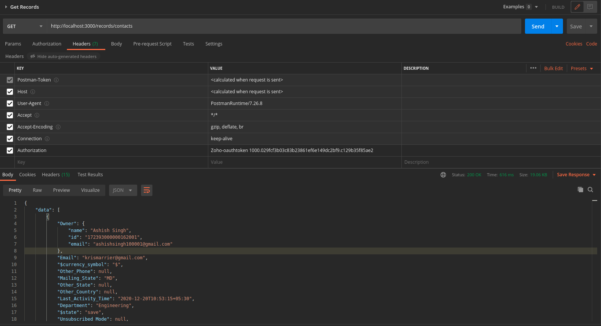
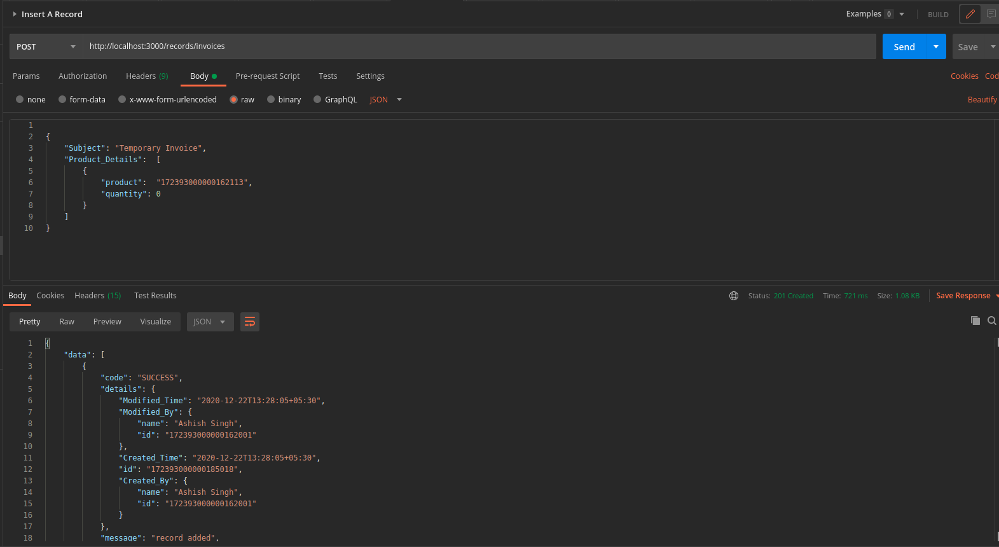
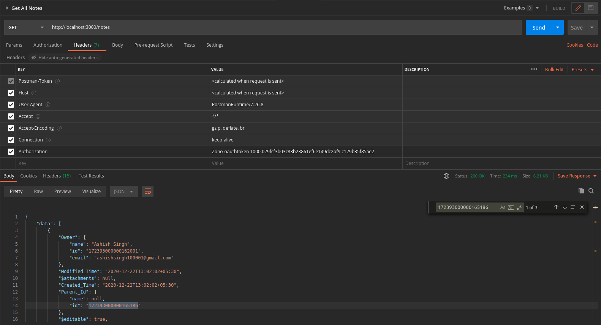
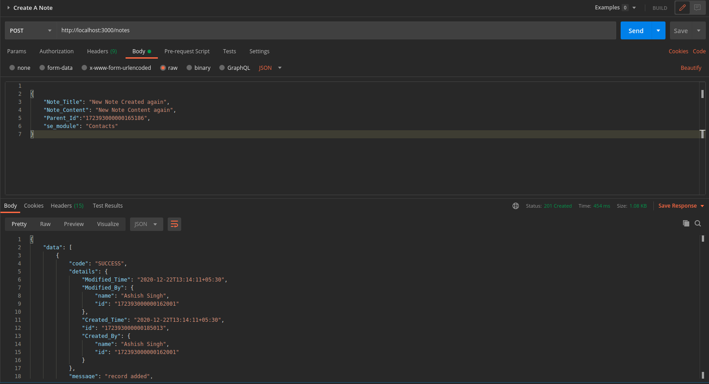
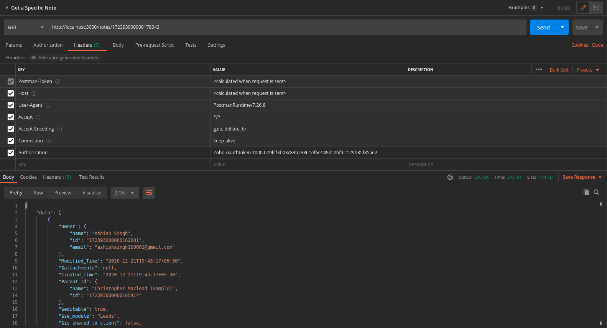
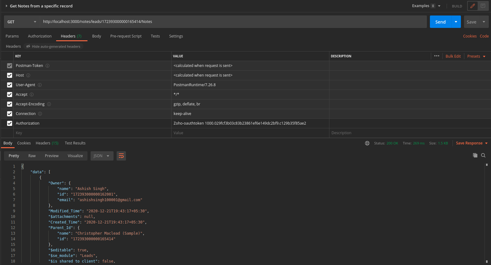

# Zoho API

## Genrating Authentication code & access & refresh Token

- Create A Zoho CRM Account
- set callback url in `config.env` file (the one which you provided while creating account)
- Go to [zoho developer console](https://accounts.zoho.com/developerconsole)
  - Create a self client , Add necessary scopes or you can use `aaaserver.profile.READ,ZohoCRM.users.ALL,ZohoCRM.modules.ALL,ZohoCRM.settings.all` for ALL, then download the file `self-client.json`
- Copy content of `self-client.json` inside the `/util/client.json`
- run script `/util/generateToken.js`
  - ```js
      node generateToken.js
    ```
- U will get your access & refresh Token in console
- 

- copy the _refresh token_ & _api domain_ in `config.env` file

<br>

## API endpoints



- While making each request u have to pass `access_token` in header

```
    Authorization: Zoho-oauthtoken {access_token}
```

<br>

### **@ _Endpoint_: /create-access-token, _Method_: GET**

- Creates a new Access token if previous one gets expired ( each access token will be valid for 1 hr)
- New access token will be generated using `refresh_token`


<br>

### **@ _Endpoint_: /users, _Method_: GET**

- return all Users



<br>

### **@ _Endpoint:_ /users/:userId, _Method_: GET**

- returns a single user as per given id
- provide {user_id} in place of `:userId`



<br>

### **@ _Endpoint:_ /users/create-user, _Method:_ POST**

- Adds a new user
- Mandatory Fields are given in [documentation](https://www.zoho.com/crm/developer/docs/api/v2/add-user.html)



<br>

### **@ _Endpoint:_ /records/:moduleName, _Methods:_ GET**

- returns all records of the provided module.
- possible module names are given in the[documentation](https://www.zoho.com/crm/developer/docs/api/v2/get-records.html)



<br>

### **@ _Endpoint:_ /records/:moduleName, _Method:_ POST**

- Insert record into the provided module.
- possible module names & mandatory fields are given in the [documentation](https://www.zoho.com/crm/developer/docs/api/v2/insert-records.html)



<br>

### **@ _Endpoint:_ /notes, _Method:_ GET**

- return all Notes.



<br>

### **@ _Endpoint:_ /notes, _Method:_ POST**

- Add a new Note.
- mandatory Fields are given in [documentation](https://www.zoho.com/crm/developer/docs/api/v2/create-notes.html)



<br>

### **@ _Endpoint:_ /notes/:noteId, _Method:_ GET**

- return a note as per provided noteID.
- replace `:noteId` with {note_id}



<br>

### **@ _Endpoint:_ /notes/:moduleName/:recordId, _Method:_ GET**

- return Notes from a specific record.
- possible module names [documentation](https://www.zoho.com/crm/developer/docs/api/v2/get-notes.html)


