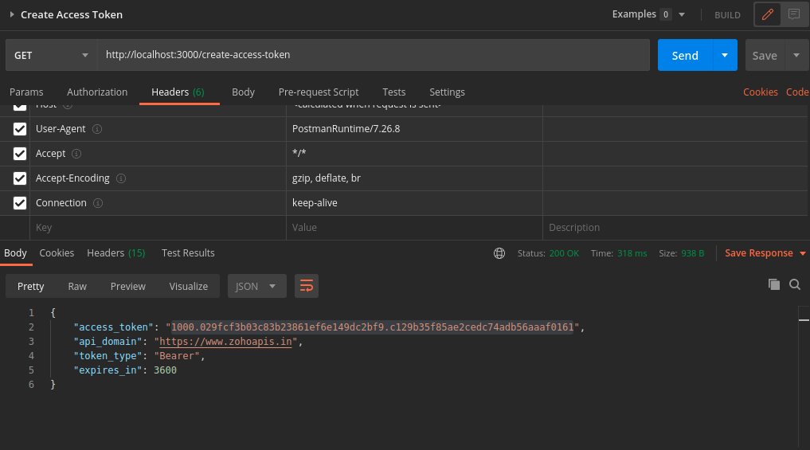

# Zoho API

## Genrating Authentication code & access & refresh Token

- Create A Zoho CRM Account
- set callback url in `config.env` file (the one which you provided while creating account)
- Go to [zoho developer console](https://accounts.zoho.com/developerconsole)
  - Create a self client , Add necessary scopes, and download the file `self-client.json`
- Copy content of `self-client.json` inside the `/util/client.json`
- run script `/util/generateToken.js`
  - ```js
      node generateToken.js
    ```
- U will get your access & refresh Token in console
  

- copy the _refresh token_ & _api domain_ in `config.env` file

<br>

## API endpoints

<br>

### @ **/create-access-token**

- Creates a new Access token if previous one gets expired ( each access token will be valid for 1 hr)



<br>

### @ **/get-all-users**

- Gives all Users in response.


<br>

### @ **/create-user**

- Creates a new User
- mandatory Fields are given in ZOHO CRM API documentations


<br>

### @ **/get-records/:parameterName**

- parameter name is any valid ZOHO module name
- returns all records of {module_name} passed in place of parameter name


<br>

### @ **/create-invoice**

- Creates an Invoice according to passed information
  - Mandatory fields in ZOHO CRM API documentation


<br>

### @ **/create-payment-order**

- Creates a payment order of passed information
  - Mandatory fields in ZOHO CRM API documentation


